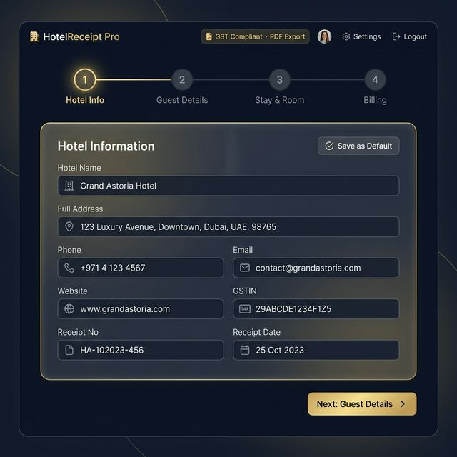
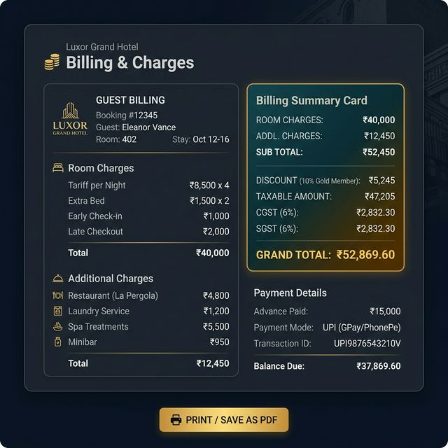
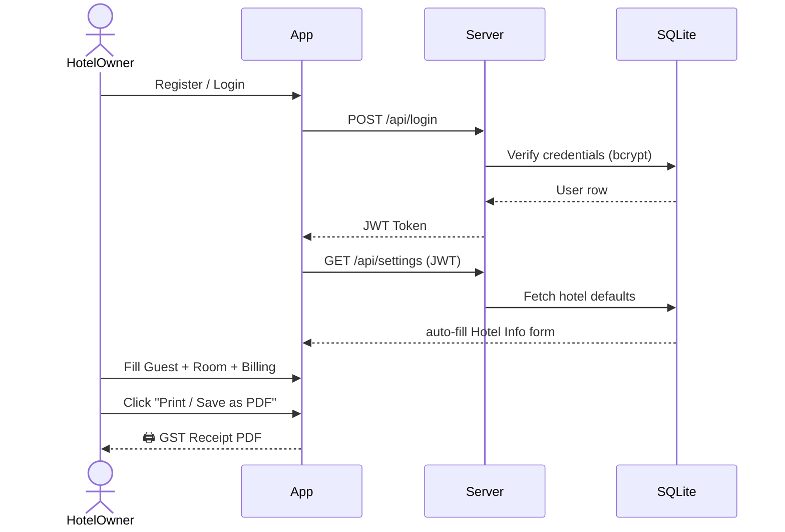

<div align="center">

# 🏨 HotelReceipt Pro

### *Professional Hotel Booking Receipt Generator*

[](https://nodejs.org)
[](https://expressjs.com)
[](https://sql.js.org)
[](https://jwt.io)
[](LICENSE)

> **GST Compliant · PDF Export · Saved Hotel Defaults · Secure Login**  
> Built for the Indian Hospitality Industry 🇮🇳

</div>

---

## ✨ Features

| Feature | Description |
|---|---|
| 🔐 **Secure Auth** | JWT-based login & registration with bcrypt password hashing |
| 💾 **Hotel Defaults** | Save your hotel details once — auto-filled on every login |
| 🧾 **GST Compliant** | Auto-calculates CGST & SGST as per Indian tax slabs (0%, 12%, 18%) |
| 🖨️ **PDF Export** | One-click browser print-to-PDF for professional receipts |
| 🪜 **4-Step Wizard** | Hotel Info → Guest Details → Stay & Room → Billing |
| 💳 **Smart Billing** | Live billing summary with discounts, advance, balance due |
| 🌙 **Premium Dark UI** | Glassmorphism design with gold accents |
| 📱 **Responsive** | Works beautifully on desktop and tablet |

---

## 📸 Screenshots

### 🔐 Login Screen


---

### 🏩 Hotel Information — Step 1


---

### 💰 Billing & PDF Export — Step 4


---

## 🗂 Project Structure

```
HotelBookingReciept/
├── index.html          # Full SPA — Auth + 4-step Receipt Wizard
├── app.js              # Frontend logic (billing calc, API calls, PDF)
├── style.css           # Premium dark theme / glassmorphism UI
├── server.js           # Node.js + Express REST API
├── package.json        # Project metadata & dependencies
├── screenshots/        # App snapshots (used in README)
└── .gitignore
```

---

## 🛠 Tech Stack

| Layer | Technology |
|---|---|
| **Frontend** | Vanilla HTML, CSS, JavaScript |
| **Backend** | Node.js + Express.js |
| **Database** | SQLite via `sql.js` (file-persisted) |
| **Auth** | JWT (`jsonwebtoken`) + `bcryptjs` |
| **Fonts** | Google Fonts — Inter & Playfair Display |
| **PDF Export** | Browser native Print-to-PDF |

---

## 🚀 Getting Started

### Prerequisites
- [Node.js](https://nodejs.org/) v18 or higher
- npm (comes with Node.js)

### Installation

```bash
# 1. Clone the repository
git clone https://github.com/imrvj/Hotel-Booking-Receipt-Generator.git

# 2. Navigate into the project folder
cd Hotel-Booking-Receipt-Generator

# 3. Install dependencies
npm install

# 4. Start the server
npm start
```

### Open in Browser

```
http://localhost:3000
```

---

## 🔑 How It Works



---

## 🧾 GST Tax Slabs (India)

| Room Tariff / Night | GST Rate | CGST | SGST |
|---|---|---|---|
| Below ₹1,000 | 0% | 0% | 0% |
| ₹1,001 – ₹7,500 | **12%** | 6% | 6% |
| Above ₹7,500 | **18%** | 9% | 9% |

---

## 📡 API Endpoints

| Method | Route | Auth | Description |
|---|---|---|---|
| `POST` | `/api/register` | ❌ | Create new hotel account |
| `POST` | `/api/login` | ❌ | Login & receive JWT |
| `GET` | `/api/settings` | ✅ JWT | Fetch saved hotel defaults |
| `POST` | `/api/settings` | ✅ JWT | Save hotel defaults |
| `POST` | `/api/change-password` | ✅ JWT | Update login password |

---

## 🙌 Author

**imrvj** — [@imrvj](https://github.com/imrvj)

> *Built with ❤️ for the Indian Hospitality Industry*

---

<div align="center">

⭐ **Star this repo if you find it useful!** ⭐

</div>
